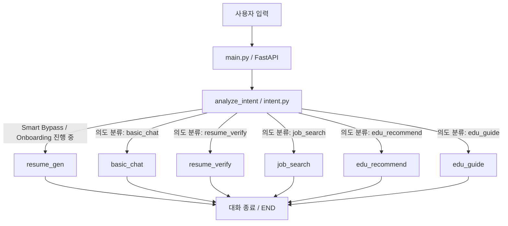

# 📂 마이내일 (MyNaeil) AI 챗봇 

마이내일은 **5060 신중년 구직자의 성공적인 제2의 인생 설계와 재취업을 지원**하기 위해 개발된 카카오톡 기반 AI 챗봇 시스템입니다.  
스파게티 코드로 얽혀 있던 단일 파일 레거시를 **FastAPI + LangGraph + Supabase pgvector RAG** 기반의 견고한 멀티 에이전트 구조로 전면 리팩토링하여, 협업 생산성과 시스템 안정성을 최적화했습니다.

---

## ✨ 핵심 기능
1. **💬 일반 일상 상담 (basic_chat)**: 친절하고 따뜻한 중장년 전문 상담원의 어조로 일상적 대화를 처리합니다.
2. **✍️ 대화형 자소서 생성 (resume_gen)**: 7단계의 직관적인 문답 온보딩을 통해 경력, 자격증, 희망 근무지 등을 수집하고 논리적인 자소서 초안(4개 항목)을 자동 완성합니다.
3. **🔍 유튜브 RAG 자소서 검증 (resume_verify)**: pgvector 벡터 검색을 통해 유튜브 인사담당자들의 실전 코칭 스크립트를 RAG로 대조하여, 수치화 분석 및 Before & After 개선 가이드를 제시합니다.
4. **💼 맞춤형 일자리 검색 (job_search)**: DB에 크롤링된 실시간 시니어 일자리 데이터를 유저 프로필(희망 직무, 근무 지역)과 연계하여 1:1 추천 목록을 생성합니다.
5. **🎓 맞춤 교육과정 추천 및 가이드 (education / guide2)**: 유저 프로필에 맞춰 맞춤형 교육 과정을 추천(edu_recommend)하고, 해당 교육에 대한 상세한 신청 방법 및 맞춤형 사전 준비 가이드(edu_guide)를 제공합니다.
6. **📋 면접 & 취업 팁 가이드**: 신중년 면접 예절, 이력서 작성 팁 등 유용한 가이드북을 제공합니다. (자소서 작성 모드 등에서 활용)

---

## 🏗️ 전체 디렉토리 구조 (Folder Structure)

```text
mynaeil_chatbot/
│
├── database/                # RAG & DB 엔지니어 담당
│   ├── connection.py        # Supabase (PostgreSQL) 연결 및 클라이언트 싱글톤 초기화
│   ├── operations.py        # users2 프로필 CRUD 및 resumes 자소서 테이블 연동
│   ├── vector_search.py     # pgvector + text-embedding-3-large 기반 RAG 비동기 검색
│   └── insert_data.py       # 자소서 꿀팁 RAG용 유튜브 대본 데이터 적재 파이프라인
│
├── nodes/                   # AI/LLM 엔지니어 담당 (LangGraph 노드)
│   ├── base.py              # 공통 LLM (Fast: gpt-4o-mini / Smart: gpt-4o) 및 API Key 예외 우회 설정
│   ├── intent.py            # 사용자 발화 분석, 스마트 온보딩 및 신규 의도(교육 추천/가이드 등) 라우팅 결정
│   ├── resume.py            # 7단계 온보딩 질문 수집 및 자소서 초안 작성 루프
│   ├── resume_verify.py     # RAG 기반의 자소서 내용 심층 피드백 및 검증
│   ├── job.py               # 프로필 기반 일자리 카카오 케로셀 카드 추천
│   ├── policy.py            # 정부 지원금 및 신중년 혜택 정책 추천
│   ├── education.py         # 유저 프로필 기반 맞춤형 직무/디지털 교육 과정 추천
│   ├── guide.py             # 신중년 맞춤형 구직/면접 가이드
│   ├── guide2.py            # 추천된 교육 과정에 대한 맞춤형 신청 및 사전 준비 가이드
│   ├── basic.py             # 웰컴 룰 답변 및 일반 일상 상담 (Fallback)
│   └── __init__.py          # 각 노드 함수 패키지 일괄 export
│
├── services/                # 크롤러 & 외부 API 연동 담당 (구현 뼈대 제공)
│   ├── recommender.py       # 콘텐츠 기반 / 협업 필터링 추천 엔진
│   ├── crawler.py           # 시니어 일자리 수집용 Selenium/BS4 크롤러
│   ├── youtube_extractor.py # 유튜브 대본 정제 및 수집기
│   ├── worknet_api.py       # 워크넷 공공 API 연동 모듈
│   └── hrd_api.py           # 고용노동부 HRD-Net API 연동 모듈
│
├── .env                     # (Git 제외) API Key 및 DB 접속 정보
├── config.py                # dotenv 기반 전역 환경 변수 관리
├── state.py                 # LangGraph의 세션별 대화 상태(AgentState) 규격 정의
├── graph.py                 # LangGraph 상태 머신의 conditional_edges 및 워크플로우 정의
├── main.py                  # FastAPI 웹 서버 엔트리포인트 (비동기 콜백 라우팅 처리)
├── delete_expired_education.py # 만료된 교육 과정 데이터를 DB에서 주기적으로 삭제하는 배치 스크립트
└── requirements.txt         # 핵심 프로젝트 의존성 목록
```

---

## 🤖 시스템 아키텍처 & LangGraph 흐름

마이내일의 핵심 상태 제어 엔진은 다음과 같은 순서로 실행됩니다.



### ⚡ 카카오톡 5초 제한 극복 (Async Callback)
카카오톡 챗봇 스킬 서버는 **5초 이내**에 응답하지 않으면 타임아웃 처리됩니다.
이를 극복하기 위해 `main.py`에 다음과 같은 **비동기 듀얼 라우팅** 설계를 도입했습니다:
* **빠른 작업 (Fast Path)**: 일반 대화나 가벼운 의도는 **동기식**으로 카카오 응답을 반환합니다. 특히, "안녕" 등 단순 인사말은 AI 분석(LLM)을 생략하는 초고속 패스(Stage 1.5)를 적용하여 타임아웃을 원천 차단했습니다.
* **느린 작업 (Slow Path)**: 자소서 자동 작성(step 6 완료 시) 또는 RAG 자소서 검증 등 LLM 추론이 오래 걸리는 경우, 즉시 카카오에 **`useCallback: true` 대기 메시지**를 동기로 반환하고, 백그라운드 태스크에서 LangGraph를 비동기로 구동시킨 뒤 완료 시점에 **카카오 콜백 URL**로 JSON 결과를 쏘아 줍니다.

### 🧭 3단계 의도 라우팅 파이프라인 (intent.py)
AI 오작동 방지 및 확실한 라우팅 제어를 위해 의도 분석을 3단계로 분리했습니다.
1. **Stage 1 (Payload 기반)**: 카카오톡 버튼 클릭 시 들어오는 `[CMD]` 패턴을 감지해 100% Rule 기반 최우선 라우팅을 수행합니다.
2. **Stage 1.5 (인사말 고속 패스)**: 5초 타임아웃 방지를 위해 자주 쓰이는 인사말("안녕", "반가워" 등)은 AI를 안 거치고 즉각 `basic_chat`으로 보냅니다.
3. **Stage 2 (Lock-in 상태)**: 사용자가 온보딩 루프(자소서 작성 중)에 빠져 있다면 자연어를 입력해도 강제로 `resume_gen`에 묶어둡니다.
4. **Stage 3 (AI NLU)**: 앞의 룰에 해당하지 않는 자유 발화에 한해서만 LLM(`gpt-4o-mini`)이 의도를 분석하여 카테고리화합니다.

---

## 🛠️ 설치 및 로컬 구동 가이드

### 1. 가상환경 생성 및 의존성 패키지 설치
프로젝트 루트 경로에서 다음 명령을 실행합니다.
```bash
# 가상환경 생성
python -m venv venv

# 가상환경 활성화 (Windows)
.\venv\Scripts\activate
# 가상환경 활성화 (Mac/Linux)
source venv/bin/activate

# 의존성 패키지 설치
pip install -r requirements.txt
```

### 2. 환경 변수(`.env`) 파일 설정
루트 디렉토리에 `.env` 파일을 생성하고 아래와 같이 API 키와 Supabase 접속 정보를 작성합니다.
*(주의: `.env` 파일은 절대 Git 레포지토리에 커밋하여 노출되지 않도록 주의해 주세요!)*

```env
# 활성화할 LLM 팩토리 (openai 또는 gemini)
ACTIVE_LLM=openai

# OpenAI API Key
OPENAI_API_KEY=sk-proj-xxxx...

# Gemini API Key (선택 사용 시)
GEMINI_API_KEY=AIzaSy...

# Supabase PostgreSQL + pgvector DB 설정
SUPABASE_URL=https://xxxx.supabase.co
SUPABASE_KEY=eyJhbGciOiJIUzI1Ni...
```

### 3. RAG 자소서 피드백용 기초 데이터 적재 (Seeding)
유튜브 인사담당자들의 실전 팁을 데이터베이스에 벡터로 임베딩하여 RAG 준비를 마칩니다. UTF-8 인코딩으로 스크립트를 기동합니다.
```bash
python database/insert_data.py
```

### 4. FastAPI 로컬 서버 및 Ngrok 실행
카카오 웹훅 연동을 테스트하려면 터미널 2개를 띄우고 각각 실행합니다.

* **터미널 1 (FastAPI 구동)**:
  ```bash
  uvicorn main:app --reload
  ```
* **터미널 2 (Ngrok 터널링)**:
  ```bash
  ngrok http 8000
  ```
  Ngrok이 발급해 준 외부 접근용 `https://[임시도메인].ngrok-free.app` 주소를 복사하여 **카카오 i 오픈빌더 스킬 서버 URL**에 `/api/chat` 경로와 함께 기입해 줍니다. (예: `https://xxxx.ngrok-free.app/api/chat`)

---

## 🧪 로컬 패키지 및 임포트 검증
코드 수정 후 챗봇 그래프 빌드나 임포트 의존성에 문제가 없는지 가볍게 유효성을 판단합니다.
```bash
python -c "import graph; print('🎉 랭그래프 컴파일 및 패키지 빌드 정상 완료!')"
```
