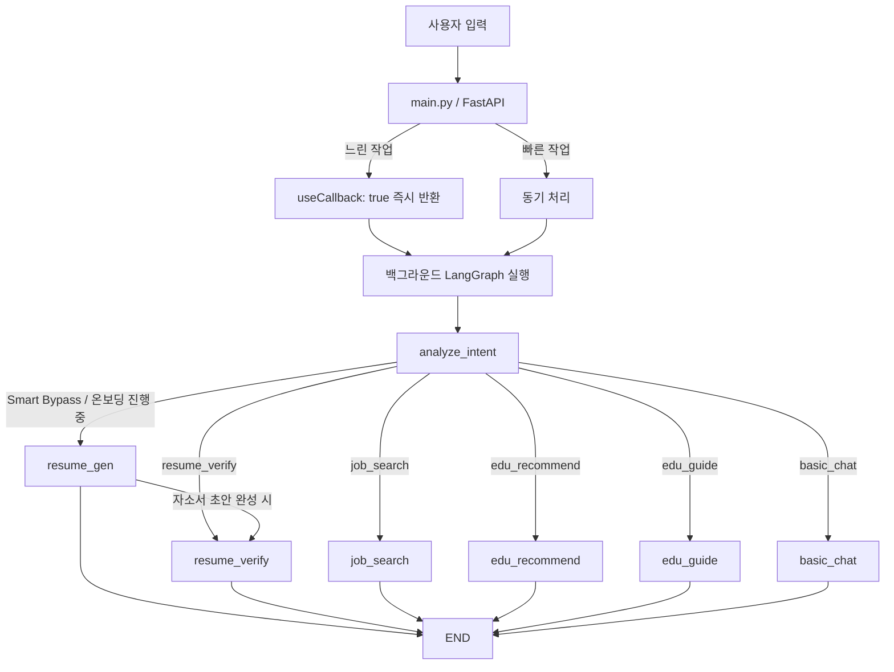

# 나의내일 (MyNaeil) AI 챗봇

나의내일은 **5060 신중년 구직자의 성공적인 재취업을 지원**하기 위해 개발된 카카오톡 기반 AI 챗봇 시스템입니다.  
**FastAPI + LangGraph + Supabase pgvector RAG** 기반의 멀티 에이전트 구조로 설계되어 있습니다.

---

## 핵심 기능

1. **일반 일상 상담 (basic_chat)**: 중장년 친화적 어조로 일상 대화를 처리합니다.
2. **대화형 자소서 생성 (resume_gen)**: 9단계 문답 온보딩을 통해 경력, 자격증, 희망 근무지 등을 수집하고 자소서 초안을 자동 완성합니다. 6번째 질문 완료 시 pgvector 기반 맞춤 공고 3개를 추천합니다.
3. **유튜브 RAG 자소서 검증 (resume_verify)**: pgvector 벡터 검색으로 유튜브 인사담당자 코칭 스크립트를 RAG로 대조하여 자소서를 첨삭합니다.
4. **맞춤형 일자리 검색 (job_search)**: 유저 프로필(희망 직무, 지역)을 기반으로 실시간 공고를 추천합니다.
5. **맞춤 교육과정 추천 (edu_recommend)**: 희망 분야에 맞는 국비 교육 정보를 안내합니다.
6. **교육 신청 가이드 (edu_guide)**: 국민내일배움카드 발급 및 교육 신청 방법을 단계별로 안내합니다.

---

## 디렉토리 구조

```text
mynaeil_chatbot/
│
├── database/
│   ├── connection.py        # Supabase 클라이언트 싱글톤 초기화
│   ├── operations.py        # users / resumes / jobs CRUD 함수 모음
│   └── vector_search.py     # text-embedding-3-small 기반 pgvector 비동기 RAG 검색
│
├── nodes/                   # LangGraph 노드
│   ├── base.py              # LLM 팩토리 (llm_fast: gpt-4o-mini / llm_smart: gpt-4o), IntentEnum
│   ├── intent.py            # 의도 분석, Smart Bypass (온보딩/자소서 흐름 자동 유지)
│   ├── onboarding.py        # 9단계 온보딩 질문 수집, 공고 추천, 자소서 작성/수정 상태 관리
│   ├── resume.py            # 자소서 초안 생성, RAG 첨삭, 항목 분리 헬퍼
│   ├── resume_verify.py     # 유튜브 RAG 기반 자소서 검증 및 첨삭 노드
│   ├── job.py               # 일자리 검색 노드 (직접 검색 기능)
│   ├── education.py         # 교육과정 추천 노드
│   ├── guide.py             # 특정 공고 지원 방법 안내 헬퍼 함수 (get_apply_guide)
│   ├── guide2.py            # 교육 신청 가이드 노드 (edu_guide)
│   ├── policy.py            # 정부 지원 정책 추천 노드
│   ├── basic.py             # 일반 일상 대화 노드 (Fallback)
│   └── __init__.py          # 노드 패키지 export
│
├── data_pipeline/
│   ├── recommend.py         # match_jobs_hybrid RPC 기반 벡터 유사도 공고 추천 엔진
│   ├── embed_jobs.py        # jobs / jobs3 / job_seoul_50 테이블 OpenAI 임베딩 파이프라인
│   ├── crawler.py           # 시니어 일자리 크롤러
│   └── work24_api.py        # 워크넷 공공 API 연동
│
├── .env                     # (Git 제외) API Key 및 DB 접속 정보
├── config.py                # 전역 환경 변수 관리
├── state.py                 # LangGraph AgentState 규격 정의
├── graph.py                 # LangGraph 워크플로우 및 conditional_edges 정의
├── main.py                  # FastAPI 엔트리포인트, 콜백 비동기 처리
└── requirements.txt         # 의존성 목록
```

---

## 시스템 아키텍처 & LangGraph 흐름



---

## 자소서 작성 흐름 (resume_gen 상태 머신)

```
step 0~5: 온보딩 9문답 수집
    ↓ (step 5 완료 시)
공고 추천 (match_jobs_hybrid 벡터 검색) → 공고 선택
    ↓
step 6~8: 온보딩 이어서 진행
    ↓ (step 8 완료 시)
자소서 초안 생성 (resume_gen) → 자소서 RAG 첨삭 (resume_verify)
    ↓
resume_status: done → 자소서 완성
```

---

## 카카오톡 5초 제한 극복 (Async Callback)

카카오톡 스킬 서버는 5초 이내에 응답하지 않으면 타임아웃 처리됩니다.  
`main.py`의 `is_slow_request()`가 아래 조건에 해당하면 콜백 모드로 전환합니다.

| 조건 | 이유 |
|------|------|
| step 5 답변 | 공고 추천 벡터 검색 수반 |
| step 8 답변 | 자소서 초안 LLM 생성 |
| editing / done 상태에서 수정 요청 | 자소서 수정 LLM 호출 |
| 교육 신청 가이드 키워드 | edu_guide LLM 생성 |

**느린 작업 처리 흐름:**
1. 카카오톡에 "처리 중이에요. 잠시만 기다려주세요 ✍️" 즉시 반환
2. 백그라운드에서 LangGraph 실행 (최대 ~50초)
3. 완료 시 카카오 callbackUrl로 결과 POST

---

## Supabase DB 구조

| 테이블 | 용도 |
|--------|------|
| `users` | 유저 온보딩 정보, step, resume_status, selected_job_id |
| `resumes` | 완성된 자기소개서 저장 |
| `jobs` | 워크넷 공고 (실제 URL, embedding) |
| `jobs3` | 서울시 공고 (내부 ID, embedding) |
| `job_seoul_50` | 서울 50플러스재단 공고 (실제 URL, embedding) |
| `courses` | 교육과정 데이터 |
| `youtube_tips` | 인사담당자 유튜브 스크립트 (RAG용) |
| `documents` | 정책 문서 (RAG용) |

**벡터 인덱스 (HNSW, cosine):**
```sql
CREATE INDEX ON jobs USING hnsw (embedding vector_cosine_ops);
CREATE INDEX ON jobs3 USING hnsw (embedding vector_cosine_ops);
CREATE INDEX ON job_seoul_50 USING hnsw (embedding vector_cosine_ops);
```

**공고 추천 RPC:**  
`match_jobs_hybrid(query_embedding vector, match_count integer)` — jobs, jobs3, job_seoul_50 3개 테이블 통합 코사인 유사도 검색

---

## 설치 및 로컬 구동 가이드

### 1. 가상환경 생성 및 의존성 설치

```bash
python -m venv venv

# Windows
.\venv\Scripts\activate
# Mac/Linux
source venv/bin/activate

pip install -r requirements.txt
```

### 2. 환경 변수 설정 (`.env`)

```env
# 활성화할 LLM (openai 또는 gemini)
ACTIVE_LLM=openai

OPENAI_API_KEY=sk-proj-xxxx...
GEMINI_API_KEY=AIzaSy...        # Gemini 사용 시

SUPABASE_URL=https://xxxx.supabase.co
SUPABASE_KEY=eyJhbGciOiJIUzI1Ni...
```

### 3. 공고 임베딩 파이프라인 실행

jobs, jobs3, job_seoul_50 테이블의 embedding 컬럼을 채웁니다.

```bash
python data_pipeline/embed_jobs.py
```

### 4. RAG 데이터 적재

```bash
python database/insert_data.py
```

### 5. FastAPI 서버 및 Ngrok 실행

```bash
# 터미널 1: FastAPI 서버
uvicorn main:app --reload

# 터미널 2: Ngrok 터널링
ngrok http 8000
```

Ngrok 발급 URL을 카카오 i 오픈빌더 스킬 서버 URL에 `/api/chat` 경로와 함께 등록합니다.

---

## 빌드 검증

```bash
python -c "import graph; print('랭그래프 컴파일 정상 완료!')"
```
